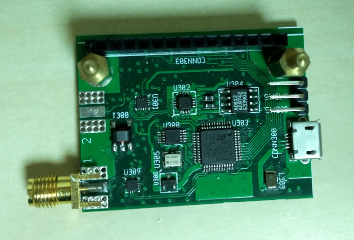

# S-A-A-1
Simple Antenna Analyzer V1

This is the predecessor to S-A-A V2.

S-A-A V1 covers 0.1MHz to 250MHz using a Si5351 and measures S11 and S21. There is no LCD and only a USB interface.

**TODO: get firmware in shape and add it to this repository.**
